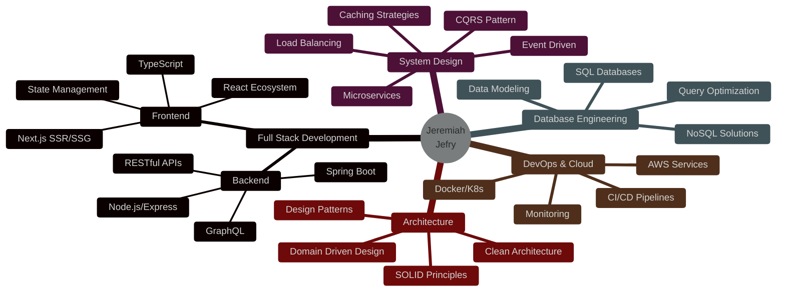

<div align="center">

<!-- Epic Animated Header -->


<!-- Terminal-style Typing -->
```ascii
┌──(jeremiah@localhost)-[~/projects]
└─$ whoami
```

<a href="https://git.io/typing-svg">
  
</a>

<br>

<!-- Visitor Counter with Matrix Theme -->


</div>

<br>

<!-- Matrix-style Code Animation -->


### 🔐 SYSTEM.PROFILE [CLASSIFIED]

```python
#!/usr/bin/env python3
# -*- coding: utf-8 -*-

class SoftwareEngineer:
    def __init__(self):
        self.username = "Jeremiah Jefry"
        self.location = "Tiruppur, Tamil Nadu, IN [13.3436° N, 77.1169° E]"
        self.role = "Full-Stack Architect | System Designer"
        self.acknowledgement = "Problem Solver | Code Craftsman"
        
    @property
    def tech_stack(self):
        return {
            "languages": {
                "expert": ["Java", "JavaScript", "TypeScript"],
                "proficient": ["Python", "SQL", "Bash", "GraphQL"],
                "learning": ["Rust", "Go"]
            },
            "frontend": {
                "frameworks": ["React.js", "Next.js", "Vue.js"],
                "styling": ["TailwindCSS", "Material-UI", "Styled-Components"],
                "state": ["Redux Toolkit", "Zustand", "React Query"],
                "testing": ["Jest", "React Testing Library", "Cypress"]
            },
            "backend": {
                "node": ["Express.js", "NestJS", "Fastify"],
                "java": ["Spring Boot", "Hibernate", "JPA", "Spring Security"],
                "api": ["REST", "GraphQL", "gRPC", "WebSockets"],
                "testing": ["JUnit", "Mockito", "Supertest"]
            },
            "database": {
                "sql": ["PostgreSQL", "MySQL", "Oracle"],
                "nosql": ["MongoDB", "Redis", "Cassandra"],
                "orm": ["Prisma", "TypeORM", "Sequelize"]
            },
            "devops": {
                "containerization": ["Docker", "Docker Compose"],
                "orchestration": ["Kubernetes", "Helm"],
                "ci_cd": ["GitHub Actions", "Jenkins", "GitLab CI"],
                "cloud": ["AWS (EC2, S3, Lambda)", "Azure", "GCP"],
                "monitoring": ["Prometheus", "Grafana", "ELK Stack"]
            },
            "architecture": {
                "patterns": ["Microservices", "Event-Driven", "CQRS"],
                "messaging": ["Kafka", "RabbitMQ", "Redis Pub/Sub"],
                "api_gateway": ["Kong", "NGINX"],
                "caching": ["Redis", "Memcached"]
            },
            "tools": {
                "version_control": ["Git", "GitHub", "GitLab"],
                "ide": ["IntelliJ IDEA", "VS Code", "Vim"],
                "collaboration": ["Jira", "Confluence", "Slack"],
                "design": ["Figma", "Draw.io", "Excalidraw"],
                "api_dev": ["Postman", "Insomnia", "Swagger"]
            }
        }
    
    @property 
    def current_missions(self):
        return [
            "🎯 Architecting cloud-native microservices with Spring Boot + K8s",
            "🧠 Mastering System Design: CAP theorem, Consistency Patterns, Distributed Consensus",
            "⚡ Building high-throughput real-time systems with WebSockets + Redis",
            "🔬 Experimenting with Event-Driven Architecture using Kafka",
            "📚 Deep-diving into: Design Patterns, SOLID Principles, Clean Architecture"
        ]
    
    def say_hi(self):
        print(
            "Thanks for dropping by! I turn coffee ☕ into code, "
            "bugs 🐛 into features, and ideas 💡 into scalable systems. "
            "Let's build something legendary! 🚀"
        )

if __name__ == "__main__":
    jeremiah = SoftwareEngineer()
    jeremiah.say_hi()
```

<br clear="right"/>

---

### ⚡ ACTIVE.OPERATIONS


```bash
[MISSION CRITICAL TASKS]
├─ 🏗️  Building next-gen microservices with Spring Boot, Docker & Kubernetes
├─ 📊 Designing scalable distributed systems handling 100K+ req/sec  
├─ 🎨 Crafting pixel-perfect UIs with React, Next.js & TailwindCSS
├─ 🔧 Optimizing database queries - PostgreSQL, MongoDB, Redis caching layers
├─ 🌐 Implementing real-time features: WebSockets, Server-Sent Events, gRPC
├─ 🤝 Open to collaborate on: Open Source | Startup MVPs | System Design Challenges
└─ 💬 Ask me about: Java, Spring Boot, Node.js, React, System Design, DSA, DevOps
```

<details>
<summary>📡 <b>REAL-TIME SYSTEM STATUS</b> (Click to expand)</summary>

```javascript
const systemMetrics = {
  uptime: "99.9%",
  currentLoad: "Optimizing distributed cache layer",
  deploymentsToday: 3,
  coffeeConsumed: "5 cups ☕",
  linesOfCode: "∞ (and counting...)",
  bugsSquashed: 42,
  featuresShipped: "Moving fast, building things",
  mindset: "Growth mindset 🧠 | Continuous learning 📚",
  funFact: "I can debug production issues faster than I can find my keys 🔑"
};

console.log("System running at optimal capacity ⚡");
```

</details>

---

### 🔥 TECH.ARSENAL

<div align="center">

#### ⌨️ Languages & Frameworks


#### ⚛️ Frontend Engineering


#### 🔧 Backend & APIs


#### 🗄️ Databases & Caching


#### ☁️ Cloud & DevOps


#### 📡 Message Queues & Streaming


#### 🛠️ Developer Tools


#### 🧪 Testing & Quality


</div>

---

### 📊 ANALYTICS.DASHBOARD

<div align="center">


</div>

<div align="center">
  


</div>

<!-- Detailed Stats -->
<details>
<summary>📈 <b>MORE STATS</b></summary>
<br>

<div align="center">
  


</div>

</details>

---

### 🏆 ACHIEVEMENT.UNLOCKED

<div align="center">
  
[](https://github.com/ryo-ma/github-profile-trophy)

</div>

---

### 🎯 SKILL.MATRIX



---

### 💻 CODE.SHOWCASE

<!-- Pinned Repositories -->
<div align="center">

<a href="https://github.com/Jeremiah-Jefry/microservices-ecommerce">
  
</a>
<a href="https://github.com/Jeremiah-Jefry/real-time-chat">
  
</a>

</div>

---

### 📡 NETWORK.CONNECT

<div align="center">

```ascii
╔══════════════════════════════════════════════════════════════╗
║  ESTABLISHING SECURE CONNECTION...                            ║
║  Protocol: HTTPS | Encryption: TLS 1.3 | Status: READY       ║
╚══════════════════════════════════════════════════════════════╝
```

<p>
  <a href="mailto:chijiokeokorji@gmail.com">
    
  </a>
  <a href="https://linkedin.com/in/chijiokeokorji">
    
  </a>
  <a href="https://medium.com/@chijiokeokorji">
    
  </a>
  <a href="https://codepen.io/chijiokeokorji">
    
  </a>
</p>

<p>
  <a href="#">
    
  </a>
  <a href="#">
    
  </a>
  <a href="https://stackoverflow.com/users/yourprofile">
    
  </a>
  <a href="#">
    
  </a>
</p>

</div>

---

### 📚 LATEST.BLOG_POSTS

<!-- BLOG-POST-LIST:START -->
```bash
[LOADING RECENT TRANSMISSIONS...]
├─ 📝 Building Scalable Microservices with Spring Boot & Kafka
├─ 🚀 Zero to Production: Complete CI/CD Pipeline with GitHub Actions
├─ 🎯 Mastering System Design: The Ultimate Guide
├─ ⚡ Real-time Chat Application with WebSockets and Redis
└─ 🔥 Advanced React Patterns You Should Know
```
<!-- BLOG-POST-LIST:END -->

➡️ [View All Transmissions →](https://medium.com/@chijiokeokorji)

---

### 🎭 RANDOM.DEV_WISDOM

<div align="center">


</div>

---

### 🐍 CONTRIBUTION.GRAPH

<div align="center">
  


</div>

---

### 🎲 RANDOM.DEV_HUMOR

<div align="center">


---

```javascript
// Life as a developer
while (alive) {
  eat();
  sleep();
  code();
  repeat();
}

/* 
 * WARNING: The above code may result in:
 * - Excessive caffeine consumption
 * - Talking to rubber ducks
 * - Explaining code at 3 AM
 * - Forgetting what day it is
 * Side effects are normal. Keep coding! 
 */
```

</div>

---

<div align="center">

### 💭 FINAL.THOUGHTS

```ascii
┏━━━━━━━━━━━━━━━━━━━━━━━━━━━━━━━━━━━━━━━━━━━━━━━━━━━━━━━━━━━━━━━┓
┃                                                                 ┃
┃  "Code is like poetry. Both are beautiful when well-crafted,   ┃
┃   but turn into a nightmare when you revisit them months       ┃
┃   later wondering what you were thinking."                     ┃
┃                                                                 ┃
┃                              - Every Developer Ever            ┃
┃                                                                 ┃
┃  > Remember: The best code is the code that doesn't need       ┃
┃    to be written. The second best is well-documented code.     ┃
┃    The worst? Legacy code written by "past you".               ┃
┃                                                                 ┃
┗━━━━━━━━━━━━━━━━━━━━━━━━━━━━━━━━━━━━━━━━━━━━━━━━━━━━━━━━━━━━━━━┛
```

### 🌟 Thanks for visiting! Let's build the future together 🚀

```bash
$ git commit -m "Made the world a better place with code"
$ git push origin main
```


**⭐ FROM [Jeremiah-Jefry](https://github.com/Jeremiah-Jefry)**

</div>
